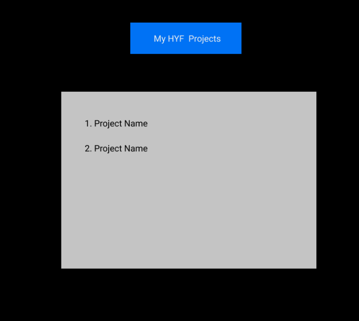

# Development Strategy

> `Fetch Github API`

A basic web page aim to learn Fetch API.

## Wireframe

## 0. Set-Up

_A User can see my initial repository and live demo_

### Repository

- Created a new repository from this [template](https://github.com/HackYourFutureBelgium/starter-basic-import-export)
- Clone the repository
- Write initial, basic README
- Add a wireframe
- Start the development strategy
- Prepare a project board
- Push the changes to GitHub
- Turn on GitHub Pages

## 1. Basic Style

**As a site visitor, I want to se styled website.**

This user story has been developed through a branch called 'style'.

### HTML

No changes

### CSS

Styled header.

### javascript

No changes

## 1. Show Stared Repos

**As a site visitor, I want to my stared projects.**

This user story has been developed through a branch called 'fetchApi'.

### HTML

add Ol element and some ids

### CSS

Styled ol and li elements

### javascript

Fetch API, add two classes for logic
